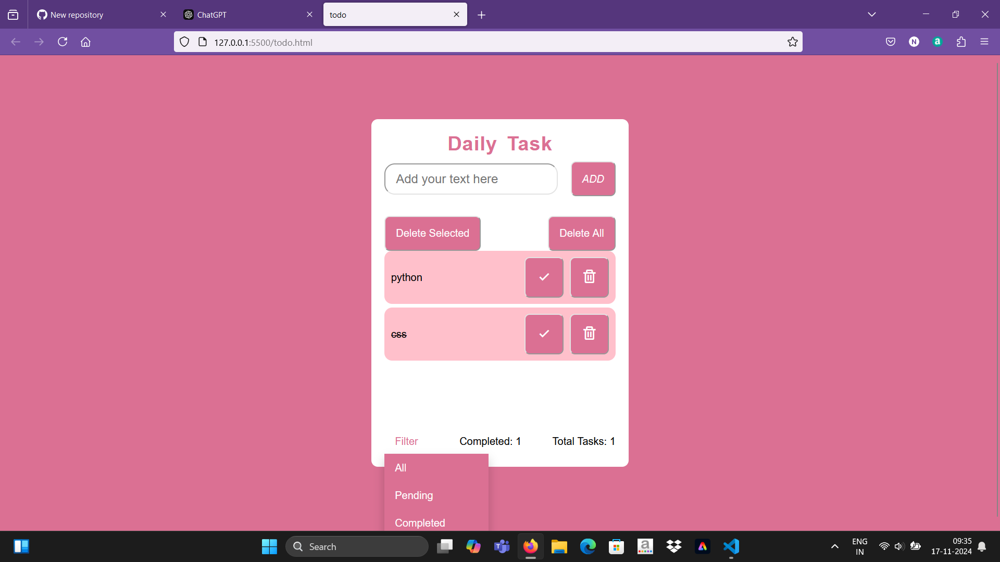

# Todo List

A simple, user-friendly Todo List application built with HTML, CSS, and JavaScript. This app helps you efficiently manage tasks with options to add, delete, edit, mark as completed, and filter tasks based on their status.

## Features

- **Add Tasks**: Add new tasks to your list easily.
- **Edit Tasks**: Update the content of existing tasks.
- **Delete Tasks**: Remove tasks from the list.
- **Mark Completion**: Mark tasks as completed with a checkmark.
- **Filter Tasks**: Filter tasks to display only completed or pending ones.

## Demo



> Add a live demo link or GIF of your application in action (if available).

## Technologies Used

- **HTML**: For creating the structure of the application.
- **CSS**: For styling and enhancing the visual appeal.
- **JavaScript**: For adding interactivity and dynamic functionality.

## Installation

Follow these steps to run the project locally:

1. Clone the repository:
   ```bash
   git clone https://github.com/Mohamednowfil/todolist.git
   ```

2. Navigate to the project directory:
   ```bash
   cd todolist
   ```

3. Open `index.html` in a web browser to view and use the application.

## Usage

1. **Add Task**:  
   - Enter a task in the input field and click the **"Add"** button to add it to the list.

2. **Edit Task**:  
   - Click the **"Edit"** button next to a task to modify its content.

3. **Delete Task**:  
   - Click the **"Delete"** button next to a task to remove it from the list.

4. **Mark Completion**:  
   - Use the checkbox next to a task to mark it as completed or pending.

5. **Filter Tasks**:  
   - Use the filter options to view:
     - All tasks
     - Only completed tasks
     - Only pending tasks

## Project Structure

```
todolist/
├── index.html       # HTML file for structure
├── styles.css       # CSS file for styling
├── script.js        # JavaScript file for functionality
└── README.md        # Documentation
```

## Functions in `script.js`

### `addTask()`
- Adds a new task to the list.

### `deleteTask(taskId)`
- Removes a specific task from the list.

### `editTask(taskId)`
- Allows editing an existing task.

### `toggleCompletion(taskId)`
- Toggles a task's status between completed and pending.

### `filterTasks(filterType)`
- Filters tasks based on the selected type (All, Completed, Pending).

## Future Enhancements

- Add local storage support to save tasks across sessions.
- Include priority levels for tasks.
- Implement a responsive design for better usability on mobile devices.

## Contributing

Contributions are welcome! Here's how you can help:
1. Fork the repository.
2. Create a new branch:
   ```bash
   git checkout -b feature-name
   ```
3. Make your changes and commit them:
   ```bash
   git commit -m "Add a feature"
   ```
4. Push to your branch:
   ```bash
   git push origin feature-name
   ```
5. Submit a pull request.

## License

This project is licensed under the [MIT License](LICENSE).
